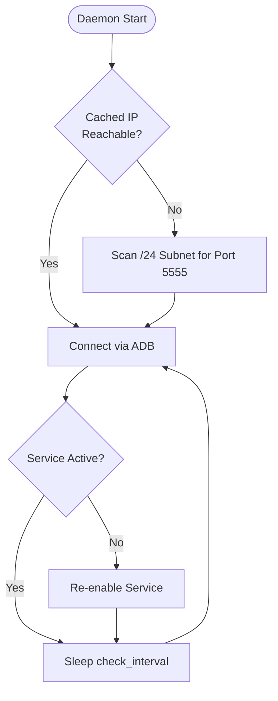

# `aesthetic-readme-craft` Skill: Aesthetic & Production-Grade READMEs

Standardizes the creation and refinement of GitHub `README.md` files into aesthetic, high-impact, visual masterpieces that immediately captivate developers and users. Inspired by the signature design language of Praveensenpai's repositories (`kbuild`, `nielsen-tv-enabler`, `ryoiki`, `kotonoha`, `jpsan`, `toss-rs`).

---

## 1. The Design Philosophy

A generic `README.md` lists commands; an **aesthetic README** sells a craft. It communicates quality, performance, and attention to detail within the first 3 seconds of page load.

### Core Tenets:
1. **Thematic Identity**: Every project has an aesthetic icon, title, and bold punchline that immediately sets the tone.
2. **Visual Hierarchy**: Badges, callouts, diagrams, and clear section dividers (`---`) guide the reader's eye effortlessly.
3. **Show, Don't Just Tell**: Utilize ASCII box diagrams, Mermaid architecture flows, or TUI mockups directly beneath the header.
4. **Zero-Friction Quickstart**: Provide a copy-pasteable 1-liner install snippet before diving into deep technical configuration.
5. **Concrete Feature Descriptions**: No generic fluff. Every feature bullet point couples a distinct emoji with technical details in backticks.

---

## 2. The Two Signature Layout Archetypes

Praveensenpai repositories follow one of two polished layout styles depending on the project type:

### Archetype A: The Centered Hero Showcase (Daemons, Services, Orchestrators)
*Exemplified by [`nielsen-tv-enabler`](https://github.com/Praveensenpai/nielsen-tv-enabler) and [`ryoiki`](https://github.com/Praveensenpai/ryoiki)*.

- Header enclosed in `<div align="center">`
- Project emoji + title (optionally with Japanese Kanji/Romaji)
- Centered bold proposition block
- Badges with `style=for-the-badge` or `style=flat-square`
- Centered bullet navigation ribbon (`•`) for quick jumping to sections
- Followed immediately by an Overview with a visual diagram or Mermaid flow

### Archetype B: The High-Impact Left-Aligned Powerhouse (CLIs, Compilers, Tools)
*Exemplified by [`kbuild`](https://github.com/Praveensenpai/kbuild), [`kotonoha`](https://github.com/Praveensenpai/kotonoha), and [`jpsan`](https://github.com/Praveensenpai/jpsan)*.

- Clean `# <Emoji> <Name> [(<Kanji/Romaji>)] [— <Subtitle>]` header
- Blockquote bold one-liner: `> **<High-impact proposition.>**`
- Badge ribbon
- High-contrast alert callout (`> [!TIP]` or `> [!WARNING]`)
- Comprehensive introductory technical summary paragraph
- ASCII box architecture diagram or terminal frame

---

## 3. Aesthetic Component Guide

### 3.1 Badges & Color Palette
Use [Shields.io](https://shields.io) with consistent badge styles (`style=flat-square` or `style=for-the-badge`).

#### Cohesive Hex Color Palette:
| Color Tone | Hex | Use Case |
| :--- | :--- | :--- |
| **Rust Orange** | `DEA584` / `orange` | Rust language badge |
| **Python Blue/Yellow** | `3776AB` | Python runtime |
| **Linux Yellow** | `FCC624` | Platform badge |
| **Catppuccin Lavender** | `cba6f7` | Release tag badge |
| **Catppuccin Mint** | `a6e3a1` | CI status badge (passing) |
| **Catppuccin Blue** | `89b4fa` | License badge (MIT / Apache) |
| **Catppuccin Pink** | `f38ba8` | NLP / Special framework badge |
| **Catppuccin Teal** | `94e2d5` | Architecture (x86_64 / aarch64) |

#### Example Badge Row:
```markdown
[](https://github.com/Praveensenpai/<repo>/releases)
[](https://www.rust-lang.org/)
[](https://github.com/Praveensenpai/<repo>)
[](LICENSE)
```

### 3.2 Navigation Jump-Links Ribbon
For comprehensive projects, provide a centered quick-navigation ribbon directly beneath badges:
```markdown
[⚡ Quick Install](#-quick-1-click-install) • [✨ Features](#-key-features) • [🔄 Architecture](#-architecture--workflow) • [💻 CLI Usage](#-cli-usage) • [⚙️ Configuration](#%EF%B8%8F-configuration)
```

### 3.3 GitHub Alert Callouts
Strategically place native GitHub markdown alerts to highlight crucial guarantees or beta warnings:

```markdown
> [!TIP]
> **Zero SSH · Zero Reverse Shells · Zero Open Ports · 100% Free**
> Operates entirely through official asynchronous batch jobs. Your local machine stays 100% idle with cold fans and zero RAM thrashing.
```

```markdown
> [!WARNING]
> **🚧 Project Status: Active Beta / Under Heavy Development**
> Features and APIs are evolving rapidly. Expect breaking changes and report any issues on the tracker.
```

### 3.4 Visual Diagrams & ASCII Boxes

#### A. Mermaid Workflow Diagram:
Use `flowchart TD` or `sequenceDiagram` to visualize state machine transitions, daemon polling loops, or async tasks:


#### B. Unicode Box-Drawing Architecture Flow:
Use clean box characters (`┌─┐`, `│ │`, `└─┘`, `▼`, `·`) in ````text` blocks for data pipelines or network transitions:
````text
┌─────────────────────────┐
│   💻 Local Workstation  │
│   · CLI Invocation      │
└────────────┬────────────┘
             │  1. In-memory tarball packaging (< 0.1s)
             ▼
┌─────────────────────────┐
│   ☁️ Remote Cloud API   │
│   · Authenticated Push  │
└────────────┬────────────┘
             │  2. Provisions isolated 30 GB container
             ▼
┌──────────────────────────────────────────────────────────┐
│   ⚡ Cloud Compute Node (30 GB RAM · Mold Linker)        │
│   · Compiles release binary                              │
└────────────┬─────────────────────────────────────────────┘
             │  3. Resilient chunked stream download
             ▼
┌─────────────────────────┐
│   📁 target/release/    │
│   · Ready to execute!   │
└─────────────────────────┘
````

### 3.5 Feature Presentation

#### Option 1: Feature Matrix Table (Best for Daemons & Complex Utilities)
```markdown
## ✨ Key Features

| Feature | Description |
|---|---|
| **🤖 Survey Auto-Dismissal** | Scans for modal dialogs, calculates checkbox coordinates, picks a member, and restores playback. |
| **🛡️ Safe & Non-Destructive** | Preserves all existing accessibility services by appending rather than replacing. |
| **🔍 Subnet Auto-Scanning** | Scans all 254 local hosts in parallel over port `5555` to find target devices automatically. |
| **⚡ Fast IP Caching** | Caches verified IP addresses for instantaneous subsequent connections. |
```

#### Option 2: Curated Emoji Bullet List (Best for CLIs & Language Tools)
```markdown
## ⚡ Key Features

- **⚡ Sub-Millisecond Morphological Analysis**: Powered by the official [`sudachi.rs`](https://github.com/WorksApplications/sudachi.rs) engine.
- **🎯 Smart Candidate Filtering**: Identifies sentences containing exactly 1 unknown word and ranks by frequency.
- **🖥️ 100% Terminal TUI**: Fully keyboard-driven interactive review using arrow keys `↑`/`↓` and `Enter`.
- **🎧 Non-Blocking Audio Playback**: Background audio daemon—zero terminal freeze or input locking.
- **📦 Embedded Zero-Dependency Database**: Local SQLite storage for card history and dictionary caches.
```

### 3.6 Curated Emojis Vocabulary

| Emoji | Context | Example |
| :---: | :--- | :--- |
| `🌸` / `⛩️` | Japanese aesthetic, culture, anime, cleanup | `🌸 言の葉 (kotonoha)` / `⛩️ 浄化 (jpsan)` |
| `⚡` / `🚀` | Blazing speed, instant execution, one-click install | `⚡ Instant & Lossless` |
| `🛡️` / `🔒` | Safety, permission handling, non-destructive logic | `🛡️ Zero Network Configuration` |
| `🤖` / `🎯` | Automation, smart heuristics, auto-detection | `🤖 Automated Survey Dismissal` |
| `📦` | Packaging, embedded databases, standalone binaries | `📦 Embedded SQLite Database` |
| `🔍` / `🔎` | Scanning, probing, search, inspection | `🔍 Subnet Auto-Scanning` |
| `🧹` / `🗑️` | Cleanup, sanitization, purges, trash management | `🧹 Clean Filename Sanitizer` |
| `🖥️` / `🎨` | Terminal UI, aesthetic banners, interactive TUI | `🖥️ 100% Terminal TUI` |
| `🔄` / `♻️` | Retry logic, persistence, background sync | `🔄 Resilient Chunked Downloader` |
| `🪄` | Magic one-liner installers | `### 🪄 One-Liner Magic (Recommended)` |

---

## 4. Production Installation & Usage Patterns

Every aesthetic README must provide both an effortless one-liner and a clean build-from-source block:

```markdown
## 🚀 Quick Start

### 🪄 One-Liner Magic (Recommended)

Install `<project>` in seconds with automatic shell completion setup:

```bash
curl -fsSL https://raw.githubusercontent.com/Praveensenpai/<repo>/main/install.sh | bash
```

<br>

### 🛠️ Building From Source

```bash
git clone https://github.com/Praveensenpai/<repo>.git
cd <repo>
cargo build --release
install -Dm 755 target/release/<binary> ~/.local/bin/<binary>
```
```

---

## 5. Configuration Block Blueprint

For applications with configuration files, present a fully annotated configuration block with realistic defaults and command-line override options:

```markdown
## ⚙️ Configuration

Settings are stored at `~/.config/<repo>/config.toml` and created automatically on first run:

```toml
# Target host address ("auto" triggers automatic subnet scan)
host = "auto"

# Daemon check interval in seconds
check_interval_secs = 5

# Enable automated dialog dismissal
auto_dismiss_prompts = true

# Backoff interval in seconds when device is unreachable
offline_retry_secs = 45
```

### CLI Overrides
Any configuration setting can be overridden at runtime:
- `-c, --config <FILE>`: Path to custom configuration file
- `-t, --interval <SECS>`: Check interval override
- `-v, --verbose`: Enable detailed debug logging
```

---

## 6. License & Attribution Footer

End every README with a clean, dignified license statement:

```markdown
---

## 📜 License

Licensed under either of [Apache License, Version 2.0](LICENSE-APACHE) or [MIT License](LICENSE-MIT) at your option.  
© Praveen Senpai ([@Praveensenpai](https://github.com/Praveensenpai))
```

---

## 7. Pre-Flight README Quality Checklist

Before finalizing any `README.md`:
- [ ] **Thematic Header**: Does the title feature an evocative emoji, clear project name, and optional Japanese aesthetic branding?
- [ ] **Bold Value Proposition**: Is there a bold 1-2 sentence statement summarizing the core value immediately below the title?
- [ ] **Badges**: Are shields.io badges styled cohesively with matching hex codes?
- [ ] **Visual Diagram**: Is there an ASCII flow diagram, Mermaid chart, or TUI screenshot illustrating the architecture?
- [ ] **Alert Callout**: Is a `> [!TIP]` or `> [!WARNING]` present to highlight key zero-friction wins or caveats?
- [ ] **Feature Section**: Are features formatted with dedicated emojis and concrete technical explanations in backticks?
- [ ] **Quick Install**: Is there a `🪄 One-Liner Magic` curl command provided?
- [ ] **Real-world Usage**: Are commands well-commented with realistic parameters rather than placeholder `<foo> <bar>`?
- [ ] **Dividers & Rhythm**: Are sections cleanly separated by `---` with balanced spacing?
